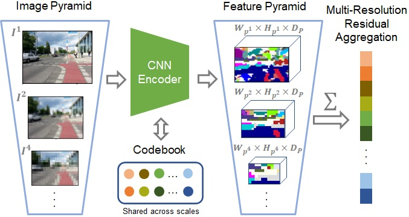

# MultiRes-NetVLAD: Augmenting Place Recognition Training with Low-Resolution Imagery

This repository contains code for the RAL2022+ICRA2022 paper "MultiRes-NetVLAD: Augmenting Place Recognition Training with Low-Resolution Imagery"

The article can be found on [arXiv](https://arxiv.org/abs/2202.09146) and the [official proceedings](https://ieeexplore.ieee.org/document/9699393/).

<p style="width: 50%; display: block; margin-left: auto; margin-right: auto">
  
</p>

## License + attribution/citation

When using code within this repository, please refer the following [paper](https://ieeexplore.ieee.org/document/9699393/) in your publications:
```
@article{khaliq2022multires,
  title={MultiRes-NetVLAD: Augmenting Place Recognition Training with Low-Resolution Imagery},
  author={Khaliq, Ahmad and Milford, Michael J and Garg, Sourav},
  journal={IEEE Robotics and Automation Letters},
  year={2022},
  publisher={IEEE},
  volume={7},  
  number={2},  
  pages={3882-3889},  
  doi={10.1109/LRA.2022.3147257}
}

```

## Installation

This repository is based on PyTorch NetVLAD [github](https://github.com/Nanne/pytorch-NetVlad), please follow its installation section. The user is advised to install wandb python package and make an account/project on wandb.


## Quick start

Here, the `main.py` contains the majority of the code, and has three different modes (`train`, `test`, `cluster`) 

### Train

To initialise the MultiRes-NetVLAD layer, it is required to first run `main.py` with the correct settings and `--mode=cluster`. 

```bash
    python main.py --mode=cluster --arch=vgg16-12 --pooling=netvlad --density_L=10 --num_clusters=64
```

Once the clusters are stored, the MultiRes-NetVLAD model can be trained using (the following default flags):

```bash
    python main.py --mode=train --arch=vgg16-12 --pooling=netvlad --density_L=10 --num_clusters=64
```

For more information on all commandline arguments run:

```bash
    python main.py --help
```

### Add/Train PCA-Whitening Layer

This repository also contain [Patch-NetVLAD](https://github.com/QVPR/Patch-NetVLAD/) code. After the successful training of MultiRes-NetVLAD, PCA-Whitening layer can be added using `add_pca.py`. The user needs to set parameters in `train.ini` in configs folder inside patchnetvlad. The user is required to set 'resumepath', 'density_L', 'dataset' and so on. By default, it is configured to train the PCA-Whitening layer of L=10 MR-NetVLAD on pittsburgh dataset. When executed with correct settings, this will add an additional checkpoint file to the same folder as resume_path.

```bash
python add_pca.py

```

### Test

The user is advised to download the L=10 MR-NetVLAD model states from [checkpoint](https://drive.google.com/file/d/1nK0is14ek5F8sGJ-wjj46T3tUfHZPYiS/view). To test the pretrained MR-NetVLAD (PCA-Wht) model on the Pittsburgh 30k testset (split can be 'test', 'val', 'val250k' and 'test250k'):

```bash
    python main.py --mode=test --resume=./code_outputs/runs/vgg16-12_L_10_netvlad_pittsburgh_cluster64_trim-2/ --dataset=pittsburgh --split=test --appendPcaLayer
```


### Pre-computed Results

Inside the precomputed_results folder, predictions and recall values for NetVLAD or L=1 MR-NetVLAD, L=10 MR-NetVLAD and other VPR techniques reported in the paper are provided.